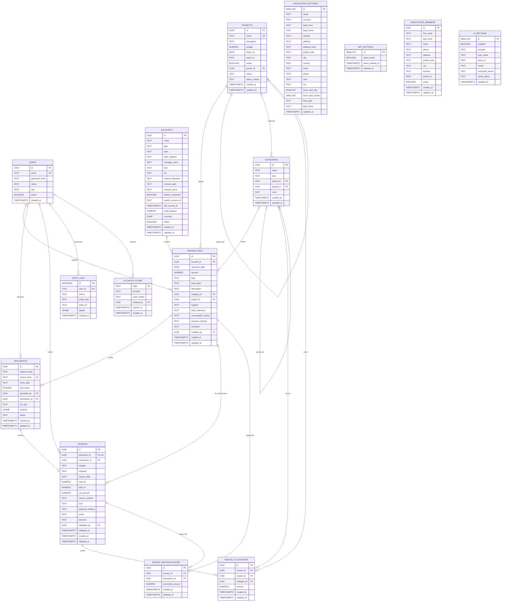

# Schéma de la base de données

Ce document représente le schéma PostgreSQL défini dans [`backend/sql/001_init.sql`](backend/sql/001_init.sql).

## Diagramme entité–relation

## Lecture des cardinalités

| Symbole | Signification |
|---|---|
| `||` | exactement un |
| `o|` | zéro ou un |
| `o{` | zéro ou plusieurs |
| `|{` | un ou plusieurs |

## Tables singleton

Les tables suivantes contiennent une seule ligne, imposée par la contrainte `CHECK (id = 1)` :

- `association_settings` : identité, coordonnées, exercice fiscal et logo de l’association ;
- `app_settings` : mode démonstration et date d’initialisation des données de démonstration ;
- `ai_settings` : fournisseur, modèle et authentification du service d’intelligence artificielle.

`association_settings`, `app_settings` et `ai_settings` sont volontairement isolées dans le diagramme : elles ne possèdent aucune clé étrangère.

`association_members` est également indépendante. Elle représente les membres de l’association, tandis que `users` représente les comptes autorisés à se connecter à l’application.

## Contraintes principales

### Utilisateurs

- `users.email` est unique.
- Rôles autorisés : `ADMIN`, `TRESORIER`, `PRESIDENT`, `BUREAU`, `BENEVOLE`.

### Projets et catégories

- Un projet peut avoir un projet parent, mais pas être son propre parent ou créer un cycle.
- Une catégorie peut avoir une catégorie parente.
- Une catégorie enfant doit conserver le même projet et le même type que sa catégorie parente.
- Types de catégorie : `RECETTE`, `DEPENSE`, `MIXTE`.
- Le couple `(categories.name, categories.kind)` est unique.

### Transactions

- Une transaction appartient obligatoirement à un compte.
- Son montant ne peut pas être nul.
- La catégorie, le projet et l’utilisateur ayant effectué la dernière modification sont optionnels.
- États de rapprochement : `NON_RAPPROCHE`, `RAPPROCHE`, `A_VERIFIER`.

### Documents et factures

- Un document ne peut pas dépasser 10 Mio.
- `documents.stored_name` est unique.
- Une facture appartient obligatoirement à un document.
- `invoices.document_id` est unique : un document ne peut produire qu’une seule facture.
- Sens de facture : `RECU` ou `EMIS`.
- La suppression d’un document supprime sa facture (`ON DELETE CASCADE`).

### Ventilation des factures

- Chaque allocation appartient obligatoirement à une facture.
- Son montant doit être strictement positif.
- La somme des allocations ne peut pas dépasser la valeur absolue du montant TTC de la facture.
- Une catégorie rattachée à un projet doit correspondre au projet de l’allocation.

### Rapprochement bancaire

`invoice_reconciliations` implémente la relation plusieurs-à-plusieurs entre les factures et les transactions :

- une facture peut être réglée par plusieurs transactions ;
- une transaction peut rapprocher plusieurs factures ;
- le montant rapproché doit être strictement positif ;
- le couple `(invoice_id, transaction_id)` est unique.

La colonne historique `invoices.transaction_id` reste présente parallèlement à cette table de rapprochement.

## Comportements de suppression

| Relation | Comportement |
|---|---|
| Compte → transactions | `RESTRICT` |
| Projet parent → projets enfants | `RESTRICT` |
| Projet → catégories | `RESTRICT` |
| Catégorie parente → catégories enfants | `SET NULL` |
| Catégorie/projet → transactions | `SET NULL` |
| Utilisateur → références métier | `SET NULL`, sauf flux OAuth en `CASCADE` |
| Transaction → documents/factures | `SET NULL` |
| Document → facture | `CASCADE` |
| Facture → allocations | `CASCADE` |
| Facture/transaction → rapprochements | `CASCADE` |
