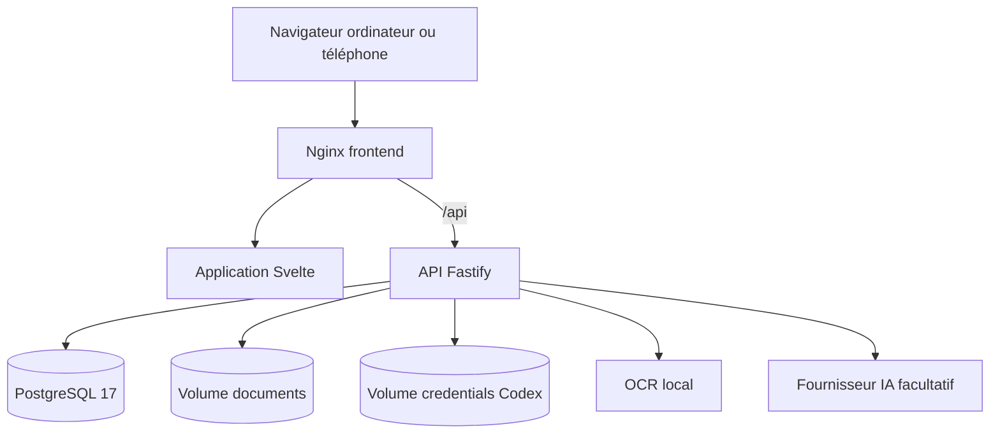
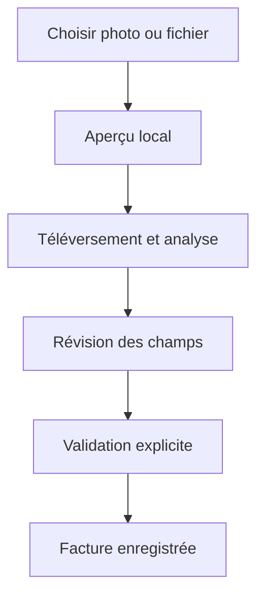
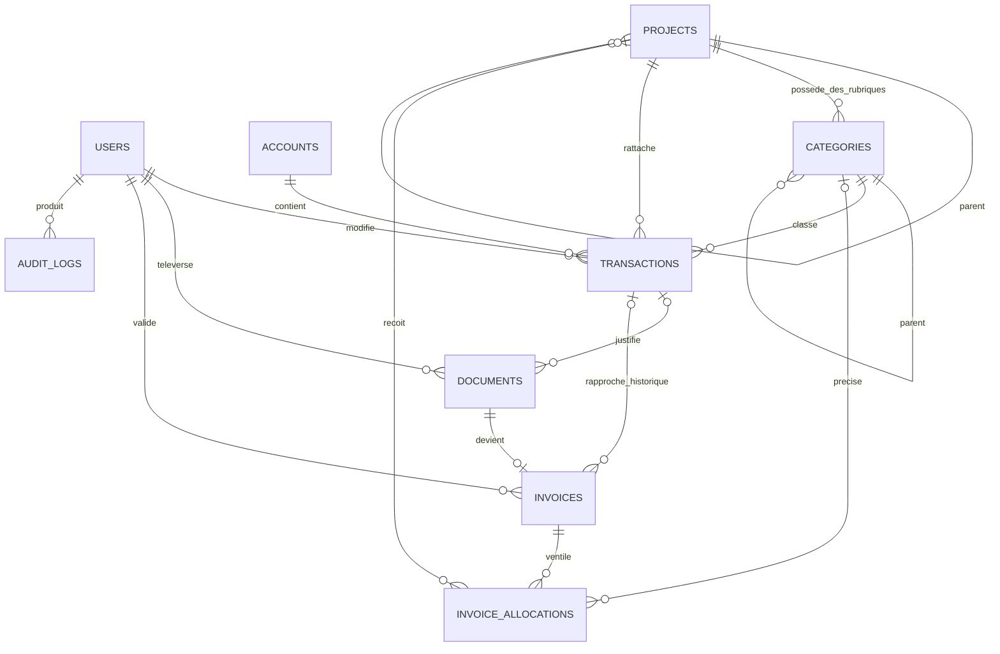

# Architecture du projet de trésorerie associative

## 1. Vue d’ensemble

L’application est une SPA mobile-first permettant à une association bénévole de gérer sa trésorerie, ses justificatifs et sa ventilation analytique.



Les trois services Docker sont :

- `frontend` : build Svelte puis service Nginx sur le port public 8080 ;
- `backend` : API Node/Fastify sur le réseau Docker interne ;
- `database` : PostgreSQL 17 sur le réseau interne.

Volumes persistants :

- `postgres-data` : données PostgreSQL ;
- `document-storage` : images et PDF originaux ;
- `codex-credentials` : session OAuth OpenAI/Codex ;
- `gemini-credentials` : session et compte Google CLI (`agy`) sous `/home/node/.gemini`.

## 2. Organisation du dépôt

```text
.
├── association_tresorerie_spec_v2.md  Spécification fonctionnelle initiale
├── architecture.md                    Architecture courante
├── context.md                         Contexte de reprise du développement
├── compose.yaml                       Orchestration Docker
├── package.json                       Scripts globaux
├── backend/
│   ├── Dockerfile
│   ├── package.json
│   ├── sql/001_init.sql               Schéma et migrations idempotentes
│   ├── src/
│   │   ├── app.ts                     Construction Fastify et middleware
│   │   ├── index.ts                   Démarrage du serveur
│   │   ├── config.ts                  Variables d’environnement
│   │   ├── db.ts                      Pool PostgreSQL et transactions
│   │   ├── migrate.ts                 Migration et données de démonstration
│   │   ├── audit.ts                   Journalisation métier
│   │   ├── errors.ts                  Validation et erreurs API
│   │   ├── routes/                    Endpoints HTTP
│   │   └── services/                  OCR, IA, fichiers, CSV, chiffrement
│   └── test/                           Tests Node
└── frontend/
    ├── Dockerfile
    ├── nginx.conf
    ├── package.json
    └── src/
        ├── App.svelte                  Authentification et routage principal
        ├── app.css                     Design global responsive
        ├── components/                 Shell et composants réutilisables
        ├── lib/                        Client API, types et utilitaires
        └── pages/                      Écrans métier
```

## 3. Frontend

### 3.1 Technologies

- Svelte 5.
- TypeScript.
- Vite 7.
- CSS global personnalisé sans bibliothèque de composants.
- Navigation SPA par hash, par exemple `#/invoices`.

### 3.2 Point d’entrée et navigation

`frontend/src/App.svelte` :

- vérifie le JWT avec `/api/auth/me` ;
- affiche `Login.svelte` sans session ;
- affiche `Shell.svelte` après connexion ;
- contrôle l’accès à la configuration selon le rôle `ADMIN` ;
- ouvre globalement `InvoiceCapture.svelte` depuis le menu principal ;
- rafraîchit la liste des factures après une capture validée.

Pages actuelles :

| Page | Fichier | Responsabilité |
|---|---|---|
| Connexion | `pages/Login.svelte` | Authentification |
| Tableau de bord | `pages/Dashboard.svelte` | Synthèse financière et actions rapides |
| Comptes | `pages/Accounts.svelte` | Comptes bancaires |
| Opérations | `pages/Transactions.svelte` | CRUD, filtres, import/export CSV |
| Factures | `pages/Invoices.svelte` | Liste, aperçu du document et ventilation |
| Catégories | `pages/Resources.svelte` | Catégories globales et rubriques de projet |
| Projets | `pages/Resources.svelte` | Projets et sous-projets |
| Configuration | `pages/Configuration.svelte` | Association, membres, utilisateurs, IA et base |

### 3.3 Client API

`frontend/src/lib/api.ts` fournit :

- ajout automatique du JWT ;
- sérialisation JSON ;
- téléversement multipart ;
- téléchargement authentifié des documents ;
- conversion des erreurs API en `ApiError` ;
- déconnexion automatique sur HTTP 401 ;
- messages spécifiques pour HTTP 403 et 413 lors des téléversements.

Le JWT est actuellement stocké dans `localStorage` sous `treso_token`.

### 3.4 Capture de facture

`frontend/src/components/InvoiceCapture.svelte` implémente un workflow en cinq étapes :



Fonctions importantes :

- capture caméra avec `capture="environment"` ;
- import image ou PDF ;
- redimensionnement et compression JPEG des grandes photos ;
- choix « Analyse avec IA » seulement si une IA est activée et configurée ;
- modification de tous les champs extraits ;
- création rapide de projet, sous-projet ou rubrique ;
- ventilation multi-lignes avant validation ;
- blocage frontend si le total ventilé dépasse le TTC.

### 3.5 Style et ergonomie

`frontend/src/app.css` définit :

- palette vert/ivoire avec accent ambre ;
- vues mobiles en cartes plutôt qu’en tableaux larges ;
- barre de navigation mobile fixe ;
- sidebar desktop ;
- modales plein écran sur mobile ;
- indicateurs d’incertitude OCR ;
- formulaires tactiles ;
- prise en charge de `prefers-reduced-motion`.

## 4. Backend

### 4.1 Construction Fastify

`backend/src/app.ts` :

- crée le serveur Fastify ;
- active les logs avec masquage des champs sensibles ;
- configure JWT ;
- configure multipart à un fichier et 10 Mo ;
- expose les décorateurs `authenticate` et `requireAdmin` ;
- centralise les erreurs métier et PostgreSQL ;
- expose `/api/health` ;
- enregistre toutes les routes sous `/api`.

### 4.2 Configuration

`backend/src/config.ts` lit :

| Variable | Usage | Défaut de développement |
|---|---|---|
| `HOST` | Adresse d’écoute | `0.0.0.0` |
| `PORT` | Port API | `3000` |
| `DATABASE_URL` | PostgreSQL | base locale |
| `JWT_SECRET` | Signature JWT et chiffrement actuel des secrets | valeur de développement |
| `STORAGE_DIR` | Racine des documents | `storage` |
| `CODEX_HOME` | Credentials OpenAI/Codex | `codex-data` |
| `MIGRATION_FILE` | SQL au démarrage | `sql/001_init.sql` |
| `NODE_ENV` | Mode production | — |

### 4.3 Accès PostgreSQL

`backend/src/db.ts` contient le pool `pg`, les requêtes génériques et `withTransaction`.

`backend/src/migrate.ts` :

1. prend un verrou advisory PostgreSQL ;
2. rejoue `001_init.sql` dans une transaction ;
3. crée ou remet à niveau les données de démonstration ;
4. fournit le test de santé de la base.

Le SQL est conçu pour être idempotent avec `IF NOT EXISTS`, blocs `DO`, fonctions et triggers remplacés. Il n’existe pas encore de table de versions de migrations.

## 5. Modèle de données

### 5.1 Relations principales



### 5.2 Tables

#### `users`

Utilisateurs de l’application : e-mail unique, hash BCrypt, nom, rôle et état actif.

Rôles autorisés :

```text
ADMIN, TRESORIER, PRESIDENT, BUREAU, BENEVOLE
```

#### `accounts`

Comptes de trésorerie : nom, type, banque, IBAN, solde initial, devise et état actif.

Le solde courant est calculé comme :

```text
solde initial + somme des opérations
```

#### `transactions`

Opérations financières : compte, date, montant signé, type, libellé bancaire, description, catégorie, projet, fournisseur, référence, statut de rapprochement et commentaire.

Convention :

- montant positif : recette ;
- montant négatif : dépense.

#### `projects`

Projets analytiques avec nom, description, budget, dates, état actif et `parent_id`.

Intégrité :

- auto-parent interdit ;
- cycles interdits par validation API et trigger SQL ;
- suppression du parent restreinte tant qu’il a des enfants.

#### `categories`

Catégories de type `RECETTE`, `DEPENSE` ou `MIXTE`.

- `project_id IS NULL` : catégorie globale ;
- `project_id` défini : rubrique dédiée au projet ;
- `parent_id` permet une hiérarchie de catégories.

Un enfant doit avoir le même type et le même projet que son parent.

#### `documents`

Métadonnées des originaux : nom utilisateur, nom stocké, MIME, taille, utilisateur, éventuelle opération, texte OCR, résultat JSON, statut et dates.

Statuts :

```text
ANALYSE_EN_COURS, A_VALIDER, VALIDE, ERREUR
```

#### `invoices`

Données validées : document unique, éventuelle opération historique, fournisseur, destinataire, date, TTC, HT, TVA, numéro, SIRET, paiement, e-mail et validateur.

#### `invoice_allocations`

Ventilation analytique indépendante du paiement bancaire : facture, projet facultatif, catégorie facultative et montant positif.

Règles :

- au moins un projet ou une catégorie est requis par l’API ;
- somme des lignes ≤ valeur absolue du TTC ;
- rubrique projet compatible avec le projet choisi ;
- baisse ultérieure du TTC sous le total déjà ventilé interdite ;
- triggers SQL en défense supplémentaire.

#### `association_settings`

Configuration singleton de l’association, identifiée par `id = 1` : identité, coordonnées, SIRET, RNA et début d’exercice.

#### `association_members`

Membres statutaires distincts des comptes applicatifs : identité, coordonnées, fonction, date d’entrée et état actif.

#### `ai_settings`

Configuration singleton : activation, fournisseur, mode d’authentification, URL, modèle, secret chiffré et statut OAuth.

#### `ai_oauth_flows`

États OAuth temporaires : état aléatoire, fournisseur, verifier PKCE ou marqueur device-code, utilisateur créateur et expiration.

#### `audit_logs`

Journal des actions métier : utilisateur, action, type d’entité, identifiant, détails JSON et date.

## 6. API HTTP

Toutes les routes métier, sauf connexion, callback OpenRouter et santé, nécessitent un JWT. Les routes de configuration sensibles nécessitent également `ADMIN`.

### Authentification

```text
POST /api/auth/login
GET  /api/auth/me
```

### Tableau de bord

```text
GET /api/dashboard
GET /api/dashboard/summary
```

Les agrégats utilisent le début d’exercice configuré et les montants signés des opérations.

### Comptes

```text
GET    /api/accounts
POST   /api/accounts
PUT    /api/accounts/:id
DELETE /api/accounts/:id
```

### Opérations

```text
GET    /api/transactions
POST   /api/transactions
PUT    /api/transactions/:id
DELETE /api/transactions/:id
POST   /api/transactions/import
GET    /api/transactions/export.csv
```

Filtres de liste : compte, catégorie, projet, dates, recherche, limite et offset.

### Catégories et rubriques

```text
GET    /api/categories
GET    /api/categories?projectId=:id
POST   /api/categories
PUT    /api/categories/:id
DELETE /api/categories/:id
```

### Projets

```text
GET    /api/projects
POST   /api/projects
PUT    /api/projects/:id
DELETE /api/projects/:id
```

### Documents et factures

```text
GET  /api/documents
POST /api/mobile/capture
GET  /api/documents/:id
GET  /api/documents/:id/analysis
GET  /api/documents/:id/preview
POST /api/documents/:id/validate
GET  /api/invoices
GET  /api/invoices/:id
PUT  /api/invoices/:id/allocations
```

`PUT /api/invoices/:id/allocations` remplace toutes les lignes dans une transaction PostgreSQL.

### Configuration administrateur

```text
GET    /api/config
PUT    /api/config/association
GET    /api/config/members
POST   /api/config/members
PUT    /api/config/members/:id
DELETE /api/config/members/:id
GET    /api/config/users
POST   /api/config/users
PUT    /api/config/users/:id
DELETE /api/config/users/:id
GET    /api/config/database
POST   /api/config/database/test
GET    /api/config/ai
PUT    /api/config/ai
POST   /api/config/ai/oauth/start
GET    /api/config/ai/oauth/status/:state
GET    /api/config/ai/oauth/callback
POST   /api/config/ai/oauth/complete
POST   /api/config/ai/test
```

La route suivante est accessible à tout utilisateur authentifié pour afficher l’option IA dans la capture :

```text
GET /api/config/ai/status
```

## 7. Stockage documentaire

`backend/src/services/files.ts` :

1. accepte uniquement JPEG, PNG, WEBP et PDF ;
2. lit le contenu avec la limite de 10 Mo ;
3. vérifie la signature binaire, pas seulement le MIME déclaré ;
4. crée le répertoire UTC `YYYY/MM/DD` ;
5. génère un nom UUID avec extension contrôlée ;
6. écrit avec `flag: wx` pour éviter l’écrasement ;
7. stocke seulement le chemin relatif en base.

Exemple :

```text
2026/09/20/9aef9c9e-2f36-4baf-8e48-b165985419ee.pdf
```

L’aperçu passe toujours par une route authentifiée. Le volume n’est pas servi directement par Nginx.

## 8. OCR et extraction

### 8.1 Pipeline local

`backend/src/services/ocr.ts` :

- PDF : extraction de la couche texte avec `pdf-parse` ;
- image : OCR Tesseract `fra+eng` ;
- texte : extraction heuristique avec `services/extraction.ts`.

Champs extraits :

- fournisseur ;
- destinataire ;
- numéro de facture ;
- date ;
- montant HT ;
- TVA ;
- TTC ;
- confiance et avertissements.

Si l’analyse échoue, le fichier reste archivé et le document passe à `ERREUR` avec un avertissement exploitable.

### 8.2 IA facultative

```mermaid
flowchart TD
    F[Fichier] --> OCR[OCR ou extraction PDF locale]
    OCR --> L[Analyse locale]
    L --> Q{IA demandée et configurée ?}
    Q -->|Non| R[Résultat local]
    Q -->|Oui (CLI agy)| AGY[agy CLI avec fichier + prompt MD + schéma JSON]
    Q -->|Oui (API Cloud)| AI[Analyse du texte OCR par l'API]
    AGY --> M[Validation et fusion champ par champ]
    AI --> M
    M --> R
    AGY -->|Erreur| R
    AI -->|Erreur| R
```

- En mode **CLI (`agy`)**, le fichier original (PDF ou image) ainsi que le prompt Markdown d'instructions (`prompts/analyse_justificatif.md`) sont directement fournis à `agy` avec `--add-dir`. Cela permet une analyse multimodale directe (particulièrement utile pour les PDF images sans couche texte).
- En mode **API Cloud**, le texte OCR extrait localement est transmis au fournisseur sélectionné.

`mergeAiAnalysis` refuse les valeurs hors format, les dates invalides et les montants négatifs ou excessifs.

## 9. Fournisseurs IA et authentification

### 9.1 Google Gemini / Antigravity CLI (`agy`)

- **Mode CLI (terminal / TUI)** :
  - utilise l'exécutable local `agy` en mode impression non interactive (`agy --print`) pour l'extraction de factures ;
  - transmet le document réel et le fichier prompt Markdown (`backend/prompts/analyse_justificatif.md`) avec le schéma JSON strict ;
  - applique les drapeaux `--dangerously-skip-permissions`, `--json-schema` et `--output-format json` ;
  - ne requiert aucune clé API applicative, s'appuyant sur la session de compte Google de `agy` ;
  - intègre un terminal web interactif PTY (xterm.js + SSE) accessible via le bouton « Ouvrir le terminal / TUI agy » pour effectuer l'authentification Google initiale (code OAuth) ou configurer le CLI directement dans le conteneur ;
  - endpoints dédiés : `POST /api/config/ai/terminal/start`, `GET /api/config/ai/terminal/:sessionId/stream`, `POST /api/config/ai/terminal/:sessionId/input`, `POST /api/config/ai/terminal/:sessionId/stop` ;
  - persistance des credentials du CLI dans le volume Docker `gemini-credentials` (`/home/node/.gemini`) ;
  - supporte les modèles Gemini (par exemple `gemini-3.8-flash-high`, `gemini-3.7-flash-high`).
- **Mode Clé API** :
  - utilise l'endpoint OpenAI-compatible officiel de Google Gemini (`https://generativelanguage.googleapis.com/v1beta/openai`) ;
  - authentification par clé API Google AI Studio en bearer token.


### 9.2 OpenAI par clé API

Utilise le protocole `/chat/completions` sur la base configurée avec un bearer token.

### 9.3 OpenAI par OAuth

Utilise le client officiel Codex et non l’API OpenAI standard :

```text
codex login --device-auth
codex login status
codex exec --ephemeral --ignore-user-config ...
```

Le backend parse uniquement l’URL officielle et le code temporaire, puis poll le processus. L’analyse est exécutée dans un répertoire temporaire avec sandbox lecture seule, schéma JSON de sortie et délai maximal.

### 9.4 OpenRouter

- API key : protocole OpenAI avec en-têtes OpenRouter.
- OAuth : PKCE S256, `https://openrouter.ai/auth`, callback et échange contre une clé.

### 9.5 Anthropic

Utilise l’endpoint natif `/messages`, `anthropic-version` et `x-api-key`.

### 9.6 Mistral

Utilise le protocole de chat compatible configuré avec clé API.

## 10. Sécurité

Protections actuelles :

- mots de passe BCrypt, coût 12 pour le compte seed ;
- JWT obligatoire sur les données métier ;
- contrôle administrateur relu en base à chaque route de configuration ;
- requêtes PostgreSQL paramétrées ;
- transactions SQL pour les écritures multiples ;
- contraintes, clés étrangères et triggers ;
- limite multipart ;
- vérification de signature des fichiers ;
- validation du nom stocké avant lecture ;
- originaux hors de la racine web ;
- masquage des en-têtes et champs sensibles dans les logs ;
- secrets IA chiffrés en AES-GCM ;
- OAuth avec état, expiration et PKCE pour OpenRouter ;
- aucun token OAuth OpenAI renvoyé au frontend.

Points à renforcer avant production :

- remplacer tous les secrets par défaut ;
- utiliser une clé de chiffrement dédiée, indépendante de `JWT_SECRET` ;
- envisager un cookie HTTP-only à la place de `localStorage` ;
- ajouter CSP, HSTS et politique CORS explicite selon le déploiement ;
- mettre à niveau `@fastify/jwt` après étude de compatibilité ;
- ajouter une politique de sauvegarde/restauration testée ;
- ajouter limitation de débit et verrouillage progressif de connexion.

## 11. Audit

Les actions importantes appellent `audit()` : création, modification, suppression, import CSV, capture, validation et ventilation.

L’audit stocke des références et détails métier, mais ne doit jamais contenir :

- mot de passe ;
- JWT ;
- clé API ;
- token OAuth ;
- code temporaire OAuth ;
- contenu complet du document.

## 12. Déploiement Docker

### 12.1 Frontend

Le build Vite est copié dans Nginx. Nginx :

- sert la SPA ;
- renvoie `index.html` pour les routes frontend ;
- limite les requêtes à 12 Mo ;
- transmet `/api/` à `backend:3000` ;
- désactive le buffering de requête pour les fichiers ;
- utilise des timeouts de 180 secondes pour l’OCR.

### 12.2 Backend

L’image runtime Node 22 contient :

- code TypeScript compilé ;
- SQL ;
- dépendances de production ;
- `ca-certificates`, nécessaire au binaire Codex ;
- répertoires `/app/storage` et `/app/codex-data` appartenant à l’utilisateur `node`.

Le processus ne tourne pas en root.

### 12.3 Base

PostgreSQL n’expose pas de port public dans Compose. Le backend attend son healthcheck avant de démarrer.

## 13. Tests et validation

Tests backend actuels :

- fusion et validation des réponses IA ;
- protocoles OpenRouter, OpenAI/Codex et Anthropic ;
- parsing CSV ;
- extraction de factures françaises ;
- calcul et cohérence HT/TVA/TTC ;
- chiffrement AES-GCM ;
- parsing et validation des montants de ventilation.

Commandes :

```bash
cd backend && npm test
cd ../frontend && npm run check && npm run build
cd .. && npm run check
```

Validation d’intégration recommandée :

```bash
docker compose up --build -d
docker compose ps
curl http://localhost:8080/api/health
```

## 14. Règles métier structurantes

1. Une facture n’est créée qu’après validation humaine.
2. L’OCR local fonctionne sans IA.
3. Une panne IA ne doit jamais supprimer le résultat OCR local.
4. Les fichiers originaux sont conservés même si leur analyse échoue.
5. Les projets et catégories ne peuvent former de cycles.
6. Une rubrique de projet reste liée à son projet.
7. Le total des ventilations ne dépasse jamais le TTC.
8. Une ventilation de facture n’est pas une opération bancaire.
9. Les totaux financiers principaux proviennent des opérations afin d’éviter le double comptage.
10. Seuls les administrateurs accèdent à la configuration générale.

## 15. Limites actuelles et évolutions prévues

### Limites

- OCR des PDF limité aux PDF possédant une couche texte.
- Pas encore de conversion PDF image vers pages OCR.
- Le sens financier et le type documentaire ne sont pas persistés dans des colonnes de facture dédiées.
- Le rapprochement bancaire historique reste mono-lien.
- Pas de tests navigateur automatisés.
- Pas de mécanisme de migrations versionnées.
- Analytics détaillées par sous-arbre de projet encore limitées dans l’interface.

### Évolutions logiques

1. Ajouter OCR page par page des PDF scannés.
2. Persister `direction`, `document_type` et `currency` dans `invoices`.
3. Ajouter rapports par projet, sous-projet et rubrique.
4. Ajouter édition complète et désactivation des projets/catégories.
5. Remplacer les liens historiques de rapprochement par des allocations facture-opération séparées.
6. Introduire des migrations numérotées.
7. Ajouter tests API PostgreSQL et tests E2E mobile.
8. Renforcer la gestion des secrets et la sécurité de production.
9. Ajouter une stratégie de sauvegarde chiffrée de PostgreSQL et des documents.
